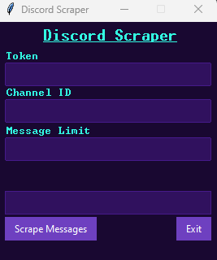

# Description 
I developed this Python script as a personal project to enhance my skills in Python programming. To use the script, users need to acquire their Discord token and enable developer mode on Discord to obtain the channel ID they wish to scrape. The script then scrapes messages from the specified channel and outputs them as a .txt file.

For guidance on obtaining your Discord token and enabling developer mode, you can refer to this helpful guide: 
https://www.androidauthority.com/get-discord-token-3149920/

## Images

